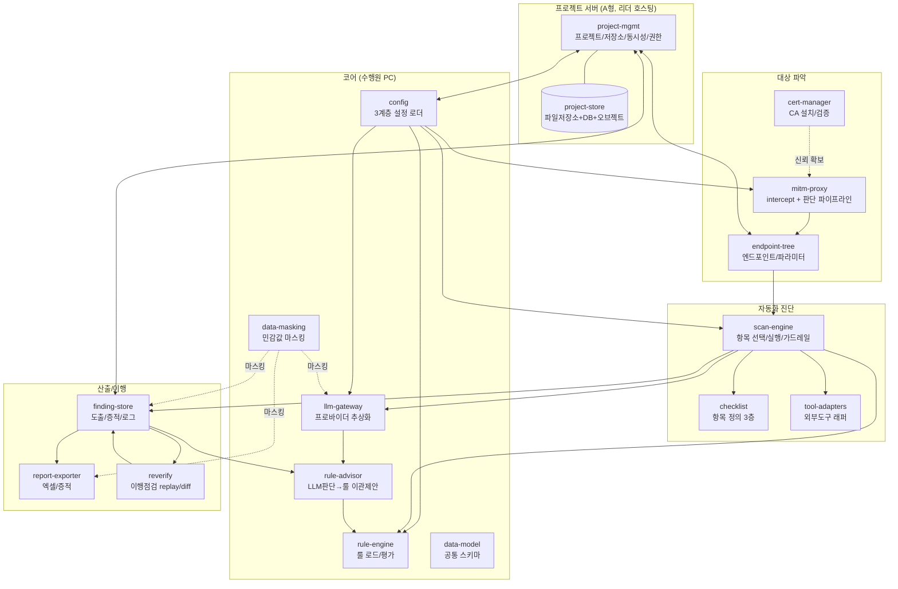

# LLM 기반 웹/모바일 자동 취약점 진단 도구 — 요구사항 및 아키텍처 정의서

> 상태: v0.7 (초안) · 기술 스택 확정(Go·goproxy·MCP Go SDK), 도구 자동설치(오프라인)·MCP 노출 반영

---

## 1. 개요 및 확정된 기술 결정

LLM을 판단 엔진으로 활용하여 웹(1차)·모바일(확장)의 취약점을 반자동으로 진단하고, 대상 파악 → 진단 → 도출리스트 → 이행점검까지 하나의 프로젝트 흐름으로 관리하는 도구.

| 항목 | 결정 |
|---|---|
| 프로젝트 공유 방식 | **중앙 웹 서버(A형)**. 프로젝트 리더가 서버를 기동해 팀에 제공. 외부 GitHub 접근 제약 환경을 가정하여 자체 호스팅(**파일 기반 저장소 + REST + DB**, 부록 A). |
| 구현 언어/배포 | **Go**. 단일 정적 바이너리로 빌드해 폐쇄망·수행원 PC 간 배포를 단순화(런타임 의존성 최소). |
| 프록시 | **MITM 기반, `goproxy`(elazarl)로 자체 구현**. 요청 파이프라인·룰·LLM 판단을 인프로세스로 내장(§5.2). |
| 도구·오케스트레이션 | 외부 진단 도구는 **자동 설치(오프라인 우선)** 후 **공식 Go MCP SDK**(`modelcontextprotocol/go-sdk`)로 MCP 노출해 활용(§5.3). |
| 룰(Rule) | 진단자가 자유롭게 추가·수정. **기본 제공 룰셋**을 함께 배포하고, 진단자 룰이 이를 오버라이드. |
| 범위 | **웹 우선 구현, 모바일은 확장**. 단, 데이터 모델·모듈 인터페이스는 처음부터 모바일을 수용하도록 설계. |
| LLM | **멀티 프로바이더**(OpenAI/GPT, Google/Gemini, Anthropic/Claude, xAI/Grok 등 API) + **로컬 LLM**(Ollama/vLLM 등). 프로바이더 추상화 계층으로 교체 가능(§7). |
| 구성 관리 | 모든 기능 **모듈화**. 설정은 3계층 파일로 분리·Import(§4). |

---

## 2. 모듈 아키텍처

### 2.1 모듈화 원칙
- 모든 기능은 **독립 모듈 + 명시적 인터페이스(계약)**로 분리한다. 모듈 간에는 데이터 모델(§3)과 이벤트/API로만 통신하며, 내부 구현에 직접 의존하지 않는다.
- 교체 가능성이 요구되는 지점은 **플러그인 인터페이스**로 정의한다: `LLMProvider`, `Detector(Rule/Tool/LLM)`, `ToolAdapter`, `ChecklistScheme`, `ReportExporter`, `ProxyEngine`.
- 각 모듈은 단독으로 테스트 가능해야 하며(단위 테스트), 외부 도구·LLM은 mock으로 대체 가능해야 한다.

### 2.2 모듈 구성



| 모듈 | 책임 | 주요 인터페이스 |
|---|---|---|
| `project-mgmt` | 프로젝트 CRUD, 저장소 버전관리, 권한, 동시성(락/머지) | REST API |
| `config` | 3계층 설정 로드/검증/Import | `ConfigLoader` |
| `llm-gateway` | 멀티 LLM 라우팅·정책·캐싱·로깅 | `LLMProvider` |
| `rule-engine` | 기본+사용자 룰 로드, 우선순위 병합, 평가 | `Rule`, `RuleSet` |
| `rule-advisor` | LLM 판단 로그 분석→룰 이관 후보 제안·섀도검증(§5.6) | `PromotionCandidate` |
| `data-model` | 공통 스키마 정의(§3) | (모든 모듈 공유) |
| `mitm-proxy` | 요청 intercept, 판단 파이프라인, 스코프 강제 (goproxy 기반) | `ProxyEngine`, `JudgeStage` |
| `cert-manager` | CA 인증서 신뢰 확인·자동설치·검증·정리(§5.2) | `CertManager` |
| `endpoint-tree` | 엔드포인트 트리·파라미터 정규화·dedup | `EndpointTree` |
| `scan-engine` | 항목 선택→실행 오케스트레이션, 가드레일 | `ScanJob`, `Detector` |
| `checklist` | 점검항목 정의(3층 §6), 탭별 스킴 | `ChecklistScheme` |
| `tool-adapters` | 외부 도구 자동설치(오프라인)·실행·MCP 노출·출력 파싱→finding 정규화 | `ToolAdapter` |
| `finding-store` | finding·증적·로그 저장, 상태 이력 | `FindingRepo` |
| `report-exporter` | 엑셀 도출리스트·증적 산출 | `ReportExporter` |
| `reverify` | 이행점검 replay·재평가 + 스캔 간 diff(공격면 변화) | `ReverifyJob` |
| `data-masking` | 민감값 탐지·마스킹(LLM 입력·로그·리포트·증적 경계) | `Masker` |

---

## 3. 공통 데이터 모델

모든 모듈이 공유하는 코어 엔티티. (필드는 대표값이며 확장 가능)

**Project**: `id, 대상명, 메인URL, 스코프(허용 도메인/경로 화이트리스트, 제외 목록), 인증정보(ref), 선택된 탭/항목, 생성/수정 이력`

**Endpoint(트리 노드)**: `path(정규화), 부모, methods[], 파라미터[], 인증필요여부, 위험판단결과(§5.2), 발견경로(breadcrumb)`
- **Parameter**: `이름, 위치(query|body|header|path|cookie), 타입추정, 필수여부, 샘플값(마스킹)`

**CheckItem(점검항목)**: §6 참조 — 3층(Detector/VulnDef/CheckItem)으로 분리.

**Finding(도출 항목)**: `id, projectId, checkItemId, 취약점명, 위험도, endpoint(ref), method, 파라미터, 사용구문(payload), 설명, 발견경로, 취약점건수, 탐지방식(rule|tool|llm), 신뢰도, 판단근거(prompt/response ref), 증적(요청·응답·스크린샷 ref), 진단자, 진단일시, 검토상태(신규|검토중|확정|오탐|보류|보고), 상태(신규|기존|재발), 이행점검(상태·재점검일시·결과), 조치권고`

**Evidence/Log**: finding과 1:N. `요청원문, 응답원문, 스크린샷경로, LLM 프롬프트/응답/모델버전, 타임스탬프`. → 이행점검 replay와 증적의 원천이므로 **재현에 필요한 최소 컨텍스트를 반드시 저장**.

**ScanRun(진단 실행 단위)**: `id, projectId, 실행자, 시각, 선택항목[], 선택대상[], 룰셋버전, LLM모델/프롬프트버전, config스냅샷, 상태(대기|진행|완료|중단), 결과요약`. → 감사·재현성·리포트·룰이관의 귀속 단위. 모든 finding·판단은 특정 ScanRun에 속한다.

**LLMDecision(판단 로그)**: `id, scanRunId, 출처(proxy-judge|scan-detect), 입력피처(정규화 path·param키·method·content-type·힌트), verdict, 근거, 신뢰도, 모델/프롬프트버전, 타임스탬프`. → §5.6 룰 이관 제안의 입력.

**RulePromotionCandidate(룰 이관 후보)**: `id, 시그니처패턴, 제안룰(draft), 근거케이스[], 적중수, 일관성%, 예상절감, 상태(제안|섀도검증중|승인|기각), 검토자`.

---

## 4. 설정 3계층 및 Import

수행원이 다른 PC에서도 무리 없이 진단하려면 설정을 성격별로 분리한다.

| 계층 | 예시 | 버전관리 | 위치 |
|---|---|---|---|
| **공유 설정** | 점검 항목표, 기본 룰셋, LLM 프롬프트, 도출리스트 양식 | 서버 버전관리 O | 프로젝트 저장소(서버) |
| **로컬 설정** | 외부 도구 실행 경로, API 키, 프록시 포트 등 **PC마다 다른 값** | 서버 미동기(로컬 전용) | `local.config.yaml` (각 PC) |
| **프로젝트 설정** | 대상 URL, 스코프, 인증정보, 선택 항목 | 서버 버전관리 O(민감정보 암호화/ref) | 프로젝트 저장소(서버) |

- 도구 경로·키를 공유 설정에서 분리하므로 "경로가 달라 안 돌아감/키 유출" 문제가 구조적으로 사라진다.
- Import: 프로젝트 접속 시 공유+프로젝트 설정은 서버에서 pull, 로컬 설정은 각 PC의 파일을 로드. 로컬 설정에 **템플릿(`local.config.example.yaml`)**을 배포한다.

---

## 5. 기능별 요구사항

### 5.1 프로젝트 관리 (중앙 웹 서버, A형)

- **FR-1.1** 프로젝트 리더가 웹 서버를 기동하면 수행원이 브라우저/클라이언트로 접속해 프로젝트를 공유한다(GitHub 대체). 외부 인터넷 GitHub 접근이 제한된 망을 가정한다.
- **FR-1.2** 저장소는 **파일 기반 저장소 + REST API + DB 인덱스**로 구성한다(부록 A 결정). finding·엔드포인트 등 메타는 DB로 검색·집계하고, 바이너리 산출물(증적·엑셀)은 오브젝트 저장소로 분리한다. **이력·되돌리기는 앱 레벨 버전/스냅샷 + 감사 로그(FR-1.5)로 구현**한다(Git 커밋 이력 대체).
- **FR-1.3** 동시성: 같은 프로젝트를 여러 수행원이 다룰 때 finding/엔드포인트 단위 **낙관적 락 또는 머지**를 지원해 충돌을 방지한다.
- **FR-1.4** 권한: 리더/수행원 역할. 프로젝트별 접근 통제. 프로젝트 인증정보(계정·세션·키 등)는 **서버에 암호화 저장**하며 진단자 로컬에 평문으로 두지 않는다.
- **FR-1.5** 감사: 모든 변경(누가·언제·무엇을)을 기록.
- **FR-1.6 사용자 지정 확장자(DRM 비간섭)**: 모든 산출·프로젝트 문서(도출리스트·리포트·프로젝트 파일)를 **사용자 지정 확장자의 도구 네이티브 포맷**으로 저장할 수 있게 한다. 국내 문서보안(DRM) 솔루션이 확장자 기반으로 파일을 자동 암호화·패키징해 수행원 PC 간 공유가 깨지는 것을 방지하기 위함. 표준 포맷(xlsx/pdf 등)으로의 **내보내기(export)는 온디맨드**로 제공하고, 조직 보안정책을 준수한다.

### 5.2 진단 대상 파악 (MITM 프록시)

- **FR-2.1 스코프 강제(최우선)**: 화이트리스트 밖 도메인/경로는 크롤링·전송 금지(하드 스코프).
- **FR-2.2 전송 전 판단 파이프라인**: 요청 생성 → intercept → **판단 스테이지 체인** → 통과 시에만 전송 → 응답에서 엔드포인트 추출. 스테이지는 사용자가 **순서·포함 여부를 구성**한다.
  - *Rule 스테이지*: 결정론적 필터. 예) `logout·delete·admin·결제확정` URL은 제외하여 가용성 보호. **기본 룰셋 제공 + 진단자 오버라이드.**
  - *LLM 스테이지*: 룰로 애매한 요청만 위임. 스테이지는 순차 강제가 아니라 **선택 조합** 가능(가용성 보장).
- **FR-2.3 토큰 최소화**: LLM 입력은 `method + 정규화 path + 파라미터 키(값 마스킹) + content-type + 판단 힌트`로 제한. 응답/헤더 전체 미포함. 정규화 후 dedup + 판단결과 캐싱으로 동일 요청 재질의 방지.
- **FR-2.4 엔드포인트 트리**: URL 경로 기반 트리. 노드 상세에서 method·파라미터 목록·인증여부·위험판단결과·발견경로 확인.
- **FR-2.5 인증 크롤링**: 세션/쿠키 주입 지원.
- **FR-2.6 인증서 상태 확인**: 프록시 CA 인증서가 대상 환경(진단자 PC 브라우저/OS, 모바일 단말·에뮬레이터/시뮬레이터)의 신뢰 저장소에 **설치·신뢰**되어 있는지 지문(fingerprint)/시리얼로 확인한다. 이미 신뢰돼 있으면 재설치하지 않는다(멱등).
- **FR-2.7 웹/OS 자동 설치**: 미설치 시 OS 신뢰 저장소에 자동 설치한다. Windows(`certutil`·루트 저장소), macOS(`security add-trusted-cert`, 관리자 권한), Linux(`update-ca-certificates`, root). Firefox 등 자체 NSS 저장소를 쓰는 브라우저는 별도 처리(NSS `certutil`/정책). 권한 상승이 필요하며, 설치 도구 경로는 로컬 설정(§4)에서 지정한다.
- **FR-2.8 모바일 자동 설치(가능 범위 + 폴백)**: 환경별 제약을 반영한다.
  - *에뮬레이터/시뮬레이터*: Android 에뮬레이터(writable-system/rooted AVD)·iOS 시뮬레이터(`simctl keychain add-root-cert`)에 자동 주입.
  - *루팅 Android 실기기*: adb로 시스템 CA 저장소에 설치.
  - *비루팅 Android(7+)*: 사용자 CA는 앱이 기본 신뢰하지 않으므로 **자동 신뢰 불가** → 안내 및 대안(대상 앱 network-security-config 반영/재패키징, 런타임 우회) 제시.
  - *iOS 실기기*: 프로파일 설치까지 자동화하되 "인증서 신뢰 설정" 활성화는 **사용자 수동 단계**(감독기기 MDM이면 푸시 가능) → 단계별 가이드 표시.
  - ⚠️ **잠정(provisional) — 방향성만 정의**. 모바일 기능 정식 추가 시 단말·OS 버전·에뮬레이터별 설치/신뢰/핀닝 처리 절차를 **정확히 재지정해야 한다**(§6.2와 함께).
- **FR-2.9 검증·정리**: 설치 후 프록시 경유 **테스트 HTTPS 요청**으로 실제 인터셉트 성공을 검증한다. **인증서 핀닝**이 있으면 CA 신뢰만으로는 불가함을 감지·표시(핀닝 우회는 별도 도구 영역). 진단 종료 시 설치한 인증서를 제거하는 **정리(uninstall)** 기능을 제공한다. CA 개인키는 민감하므로 프로젝트 단위 생성·보관을 권장한다.
- **구현 방식(Go + goproxy)**: `goproxy`의 `OnRequest`/`OnResponse` 훅에서 룰엔진·LLM 판단을 인프로세스로 수행(별도 프록시 왕복 없이 파이프라인·토큰·가용성을 한 곳에서 제어). HTTPS는 goproxy의 온더플라이 CA 인증서 생성으로 MITM하며, 이 CA를 cert-manager(§FR-2.6~2.9)가 관리한다. 스코프 강제(FR-2.1)는 `HandleConnect`에서 호스트:포트 단위로 1차 차단하고, **HTTPS는 CONNECT 단계에서 경로가 안 보이므로 경로 기반 스코프는 MITM 이후 요청 핸들러에서 2차 적용**한다. 민감값 마스킹은 이 훅에서 `data-masking`으로 처리. MCP는 상위 오케스트레이션(LLM 지휘) 계층에서 사용한다.
  - ⚠️ *검증 필요*: goproxy는 **HTTP/2·h2c(gRPC)·WebSocket** 처리가 제한적이다. HTTP/2 전용 대상·gRPC·WS 인터셉트가 필요하면 별도 처리(raw-conn hijack)나 대안(예: Google `martian`, 커스텀 h2 핸들링)을 평가한다. 인증서 핀닝은 프록시만으로 해결되지 않는다(§6.2 도구 영역).

### 5.3 자동화 진단 (Detector 기반)

- **FR-3.1 항목·대상 선택 실행**: 진단 실행 시 아래 두 축을 각각 선택하고 조합할 수 있다.
  - *항목 선택*: 탭(주요정보통신기반시설/전자금융/모바일)별 항목 중 포함할 항목을 선택(§6).
  - *대상(URL) 선택*: 엔드포인트 트리(§5.2)에서 특정 URL/엔드포인트를 **단일·다중·서브트리 단위**로 선택해 그 대상에만 진단을 실행. 미선택 시 스코프 전체를 대상으로 한다.
  - 실행 범위 = **선택 항목 × 선택 대상**. 예) 특정 URL에 특정 항목만 재실행 → 가용성 보호·이행점검·부분 재점검에 활용.
- **FR-3.2 가드레일**: 파괴성(destructive) 항목은 **기본 제외 + 명시적 opt-in**. rate limit, safe-mode, 긴급 kill switch 지원(가용성 보장).
- **FR-3.3 Rule/LLM/도구 조합**: 항목마다 탐지 방식을 지정하되 순서 강제가 아니라 **선택 조합**. 권장 패턴 = 탐지는 룰/도구, LLM은 **오탐 축소·근거 판단·조치문구 생성**. 자동화가 가용성 위험을 유발하는 항목은 **`manual`(진단자 수동 점검)**으로 지정한다(예: 버퍼오버플로우·포맷스트링).
- **FR-3.4 외부 도구 어댑터**: 로컬 설정의 경로에서 도구를 가져와 실행하고 출력을 finding으로 정규화하는 래퍼 패턴. 실행 전 존재·버전 검증.
  - *표준 도구(웹, 프록시 제외)*: `sslscan`(취약 HTTPS 프로토콜·암호 알고리즘·재협상·서버 인증서 점검 — 전자금융 WEB-SER-030·034~037, 통신구간 암호화 051 대응), `tshark`/Wireshark(평문 전송·통신 캡처 — 데이터 평문 전송 17 대응). **모바일 도입 시 도구가 대폭 증가**하므로 `ToolAdapter` 목록을 확장한다.
- **FR-3.5** 진단 액션은 모두 구조화 로그로 남긴다(§3 Evidence).
- **FR-3.6 다중 신원(권한) 진단**: 인가·권한 항목(예: 불충분한 권한 검증, 불충분한 인증, 프로세스 검증 누락)을 위해 복수 계정/역할(관리자·일반·비인가) 세션을 등록하고, 같은 엔드포인트를 서로 다른 신원으로 교차 요청해 **권한 상승·수평 이동(IDOR)**을 판정한다.
- **FR-3.7 페이로드/워드리스트 관리**: Detector가 쓰는 페이로드·워드리스트를 **버전 관리**하고 현지화한다. 특히 **한국형 중요정보 패턴**(주민등록번호·계좌번호·카드번호·보안카드·여권 등)을 노출/평문전송 탐지에 내장. 페이로드는 공유설정의 Detector 하위에 둔다(§6).
- **FR-3.8 잡 라이프사이클**: 진단은 ScanRun 단위로 **진행률·일시정지·재개·취소·완료 알림**을 지원한다(장기 실행 대비). 중단 시 부분 결과를 보존하고 재개 가능해야 한다.
- **FR-3.9 대상 자동 선정(옵션)**: 수동 선택 외에 (a) §5.2에서 **위험 판단된 엔드포인트만 자동 포함**, (b) 자주 쓰는 URL 묶음을 **대상 프로파일**로 저장·재사용하는 방식을 제공한다.
- **FR-3.10 도구 자동 설치(오프라인 우선)**: 진단에 필요한 도구가 없으면 자동 설치한다. **폐쇄망을 가정**하므로 인터넷 직접 다운로드가 아니라 **내부 도구 저장소(번들/미러)**에서 가져오는 것을 기본으로 하고, 인터넷 폴백은 허용된 경우에만 사용한다.
  - *무결성*: 버전 고정 + **체크섬/서명 검증** 후 설치·실행(공급망 위험 차단).
  - *플랫폼*: OS/arch별 패키징. 시스템 의존성 필요 시 사전 점검·명확한 오류 안내.
  - *라이선스*: 도구 번들·재배포 시 라이선스 의무를 확인한다(예: sslscan·Wireshark는 GPL 계열 — 번들 시 의무 준수). 비호환 도구는 번들하지 않고 경로 지정만 지원.
- **FR-3.11 도구 MCP 노출**: 설치된 도구를 **공식 Go MCP SDK**(`modelcontextprotocol/go-sdk`)로 MCP 툴로 노출해 LLM 오케스트레이션에서 호출한다.
  - *보안*: MCP 서버가 로컬 바이너리를 실행하는 강력한 권한이므로 **화이트리스트 도구만** 노출하고 **인자 검증·이스케이프**로 임의 명령 실행을 차단한다.
  - *성능/가용성*: 결정론적(룰 기반) 실행은 **MCP를 우회한 직접 호출** 경로도 제공한다(모든 도구 호출을 LLM/MCP로 태우지 않아 토큰·지연·가용성 보호).

### 5.4 도출리스트 생성

- **FR-4.1** finding을 **제공된 엑셀 양식(11개 컬럼)** 그대로 출력한다: `NO / 대상명 / 메인 URL / 발견 취약점 / 발견 경로 / 발견된 URL / 파라미터 / 설명 / 취약점 건수 / 사용 구문 / 비고`. 내부 데이터 모델은 §3의 전체 필드를 유지하되, **엑셀 출력은 위 11개만** 적용한다. 저장은 FR-1.6(사용자 지정 확장자)을 따른다.

> 아래는 **차후 확장 후보(현재 미적용)** — 요청 시 반영:

| 추가 컬럼(보류) | 목적 | 비고 |
|---|---|---|
| 점검항목 ID | 항목표 매핑·커버리지·규제 정합 | `발견 취약점`과 연동 |
| 위험도(1~5) | 심각도 | 항목표에서 자동 채움 |
| HTTP Method | 재현 | `파라미터`와 함께 |
| 진단일자 / 진단자 | 감사·이행점검 기준 | |
| 조치 권고 | 규제 보고 필수 | |
| 증적 참조 | 요청·응답·스크린샷 경로 | 인라인 대신 ref |
| 이행점검 상태·재점검일자·재점검 결과 | 5.5와 동일 행 연계 | |
| 상태(신규/기존/재발) | finding 생명주기 | |
| (내부) 탐지방식·신뢰도 | 오탐관리·방어가능성 | 고객 제출본에선 숨김 열 |

- **FR-4.2** 증적 스크린샷 자동 생성(차기): headless 브라우저로 finding의 재현 요청을 재실행해 캡처, `증적 참조`에 연결.
- **FR-4.3 점검결과표/커버리지 리포트**: 도출리스트(취약점만)와 별개로, **선택항목 × 대상**에 대한 전체 점검 결과표(양호|취약|해당없음|미점검)를 ScanRun 기준으로 생성. 주요정보통신·전자금융 보고서는 취약 항목뿐 아니라 **전 항목의 수행 결과**를 요구하는 경우가 많으므로 필수. 커버리지 매트릭스로 누락 점검을 즉시 식별.
- **FR-4.4 Finding 검토 상태머신**: 각 finding은 `신규 → 검토중 → 확정 | 오탐 | 보류 → 보고` 상태를 거친다. LLM 산출물은 기본 `신규`로 들어와 진단자 확정 전에는 고객 제출본에 포함되지 않는다(오탐 관리, §8 HITL과 연동). 상태 전이 이력·검토자를 기록.

### 5.5 이행점검

- **FR-5.1** 원본 로그에서 **취약 판정 finding만 선별**해 재현(전체 재스캔 아님 — 효율·가용성).
- **FR-5.2** finding의 재현 컨텍스트(요청 원문·인증상태·파라미터)를 replay → 원래 판정기준으로 재평가(룰 우선, 애매하면 LLM).
- **FR-5.3** 판정: `조치완료 / 미조치 / 부분조치 / 신규발생`. 상태 이력(최초발견→이행점검→재점검)을 타임라인으로 관리.
- **FR-5.4 스캔 간 diff(공격면 변화 탐지)**: 이행점검(취약점 회귀)과 별개로, 동일 프로젝트의 이전 ScanRun 대비 **신규/소멸 엔드포인트·파라미터·finding**을 비교한다. 엔드포인트 트리를 버전 간 diff 가능하게 저장하여, 재진단 사이 공격면이 어떻게 변했는지 식별한다.

### 5.6 룰 이관 제안 (Rule Advisor)

테스트·실진단이 쌓일수록, 룰로 처리 못 해 LLM으로 넘어간 판단 중 **일관되고 결정론적인 것**을 룰로 승격시켜 토큰 비용↓·결정론성/감사성↑·속도↑를 달성하는 피드백 루프.

- **FR-6.1 판단 로깅**: 프록시 판단 스테이지(§5.2)와 진단 Detector(§5.3)의 모든 LLM 판단을 `LLMDecision`(§3)으로 적재한다(입력피처·verdict·근거·신뢰도·모델/프롬프트버전·소속 ScanRun).
- **FR-6.2 후보 도출**: 유사 입력(정규화 시그니처)별로 판단을 군집화하고, 아래를 만족하는 패턴을 이관 후보로 제안한다.
  - 빈도(자주 등장) · 일관성(동일 시그니처 verdict 분산 낮음) · 신뢰도 높음
  - **결정론적 근거**: 판단이 path 패턴·param 이름·method·content-type 같은 **구체 피처로 설명 가능**할 것(순수 의미론적 판단은 제외)
  - 모델 버전 간 안정성
- **FR-6.3 후보 제시**: 후보마다 (a) 초안 룰(룰 DSL/YAML), (b) 근거 샘플 케이스, (c) 적중수·일관성%·예상 토큰/시간 절감, (d) 오탐 위험 경고를 함께 제시. **자동 이관 금지 — 진단자 검토·승인 필수(HITL, §8).**
- **FR-6.4 섀도 검증(Shadow/Canary)**: 승인 전(또는 승인 직후 일정 기간) 룰과 LLM을 병행 실행해 일치율을 측정하고, 임계 이상일 때만 정식 룰로 승격한다(룰의 성급한 신뢰 방지).
- **FR-6.5 이관 이력·드리프트 감지**: 승격 룰은 출처(어느 LLMDecision/ScanRun/일자/케이스 수)를 기록. 이후 샘플링으로 룰과 LLM이 불일치하면 재검토 플래그(룰 드리프트).
- **FR-6.6 적용 범위**: 프록시 위험판단·진단 탐지 양쪽에 동일 적용. 승격 룰은 사용자 룰셋에 추가되어 기본 룰을 오버라이드(§5.2).

---

## 6. 점검항목 모듈 (항목표 인코딩)

첨부된 두 항목표는 **동일 취약점이 여러 스킴에 중복**된다(예: SQL 인젝션·CSRF·XSS·SSRF·SSTI 등이 주요정보통신·전자금융 양쪽에 존재). 이를 위해 항목을 **3층으로 분리**해 탐지 로직을 재사용한다.

```yaml
# 1층) Detector — 탐지 "방법" (재사용 단위)
detector:
  id: det.sqli
  방식: [rule, tool, llm]        # 조합 가능
  도구: sqlmap                    # tool 방식일 때, 로컬설정 경로 참조
  룰셋: rules/sqli/*.yaml
  파괴성: false

# 2층) VulnDef — 취약점 "정의" (설명·분류, 중복 제거)
vuln:
  id: vuln.sqli
  이름: SQL 인젝션
  설명: "입력값 검증 미흡으로 악의적 SQL 구문이 실행되어 정보 유출·변조 가능"
  detector: det.sqli
  cwe: CWE-89                     # 선택

# 3층) CheckItem — 스킴별 "점검항목" (규제 매핑·위험도·컨텍스트)
checkitem:
  # 1:1 매핑 예
  - id: WEB-SER-001               # 전자금융 일반공통
    scheme: 전자금융
    통제구분: 서비스 보호
    context: 일반                  # 전자거래 | 일반 | 클라이언트앱
    vuln: [vuln.sqli]
    위험도: 5
  # 1:N 통합 예 — 주요정보통신의 "코드 인젝션" 1개가 하위 다수를 결합
  - id: KII-01                    # 주요정보통신기반시설 #1 (코드 인젝션)
    scheme: 주요정보통신기반시설
    context: 일반
    vuln: [vuln.os-command, vuln.ldap-injection, vuln.ssi-injection,
           vuln.xxe, vuln.ssti, vuln.xpath-injection]   # 결합 Detector = union
    상세설명:                     # 하위 유형을 상세설명에서 분할 기술
      - "OS 명령 실행 …"
      - "LDAP 인젝션 …"
      - "SSI/XXE/SSTI/XPATH …"
    위험도: null                   # 스킴 기준값
  # 전자거래 컨텍스트 예
  - id: WEB-FIN-004
    scheme: 전자금융
    통제구분: 거래정보 검증
    context: 전자거래              # 전자 거래 수행 시점에만 도출
    vuln: [vuln.fin-txn-integrity]
    위험도: 5
```

> 매핑 초안(별도 파일 `항목_매핑_초안.md`)이 전체 CheckItem↔VulnDef 대응·컨텍스트·1:N 결합을 정의한다. 이 스키마의 `vuln`은 **배열**이라 1:N 통합 항목을 자연스럽게 표현하고, `context`로 전자거래/일반/클라이언트앱을 구분한다.

### 6.1 탭(스킴) 구성

| 탭(scheme) | 원본 | 비고 |
|---|---|---|
| 주요정보통신기반시설 | 항목표1의 웹 항목(1~21) | 코드/SQL 인젝션, XSS, CSRF, SSRF, 파일 업로드/다운로드, 세션·인증·권한, 관리자페이지 노출, Method 악용 등 |
| 모바일 | 항목표1의 모바일 항목(22~34) | 루팅/탈옥 탐지, 난독화, 단말/메모리/화면 중요정보, 무결성·디버깅·딥링크 등 (별도 툴체인 §6.2) |
| 전자금융 | 항목표2 전체 | `WEB-FIN-*`(거래인증·거래정보검증 등) + `WEB-SER-*`(일반공통), 위험도 1~5 명시 |

- 중복 취약점은 2층 `VulnDef`/1층 `Detector`를 공유하고 3층 `CheckItem`만 스킴별로 둔다 → 탐지 로직 1개로 3개 탭 커버.
- **1:N 통합**: 한 스킴에서 세분화된 항목을 다른 스킴이 하나로 묶는 경우, 묶는 쪽 CheckItem이 `vuln[]` 배열로 하위를 **결합**하고 상세설명에서 분할한다.
- **컨텍스트**: `context`로 `전자거래`(WEB-FIN-*)·`일반`·`클라이언트앱`(모바일)을 구분한다. 전자거래 항목은 거래 수행 시점 진단이 필요하다.
- 위험도는 스킴별로 다를 수 있으므로 `CheckItem`에 귀속.

### 6.2 모바일 확장 대비
- 모바일 항목은 웹과 툴체인이 완전히 다르다(정적: APK/IPA·MobSF류, 동적: 후킹·계측류). `Detector` 인터페이스는 동일하게 두되, `ToolAdapter`만 모바일용을 추가하면 확장되도록 설계한다. 웹 1차 구현 시에도 `checklist`/`scan-engine` 인터페이스는 모바일 항목을 수용하는 형태로 확정한다.

---

## 7. LLM 추상화 계층 (`llm-gateway`)

- **FR-7.1 멀티 프로바이더**: OpenAI/GPT, Google/Gemini, Anthropic/Claude, xAI/Grok API + 로컬 LLM(Ollama/vLLM 등)을 공통 `LLMProvider` 인터페이스로 추상화. 설정에서 교체·라우팅.
- **FR-7.2 데이터 민감도 정책**: 프로젝트/항목별로 "이 대상은 로컬 모델만 허용" 같은 정책을 강제. 주요정보통신·전자금융 대상의 외부 전송 제약을 config로 봉인.
- **FR-7.3 결정론성·감사**: temperature 0 + 판단결과 캐싱. 프롬프트·응답·모델버전을 로그에 저장(§3)해 근거 방어 가능.
- **FR-7.4 비용/토큰 관리**: 프로바이더별 토큰·비용 계측, 입력 최소화 정책(§5.2 FR-2.3)을 게이트웨이에서 강제.
- **FR-7.5 프롬프트 버전관리 + 회귀 평가**: 공유설정의 LLM 프롬프트는 변경 시 결과가 흔들리므로 **버전 관리**한다. 프롬프트·모델 변경 시 소형 **골든셋(정답 라벨 케이스)**으로 회귀 평가를 돌려 판정 품질 저하를 사전에 잡는다.

---

## 8. 교차 관심사 (전 기능 공통)

- **Human-in-the-loop**: LLM 판단 결과는 자동 확정이 아니라 **검토·승인 대기** 상태로 두어 오탐이 보고서에 직결되지 않게 한다.
- **가드레일 공통화**: 스코프 엔진·파괴성 blocklist·rate limit을 크롤링/진단/이행점검이 **공통 컴포넌트로 공유**한다.
- **감사·재현성**: 모든 자동 판단은 입력·근거·버전을 남긴다.
- **데이터 모델 우선 확정**: §3의 코어 엔티티가 전 기능의 공통 언어. 여기부터 스키마를 고정하고 나머지를 붙인다.
- **민감 데이터 마스킹 (`data-masking`)**: 진단 대상의 중요정보가 경계를 넘을 때 자동 마스킹하는 공통 컴포넌트. 대상 데이터의 민감도가 높은 주요정보통신·전자금융에서 필수.
  - *적용 경계*: (a) **LLM 입력**(판단·오탐검토 등 외부/로컬 모델 전송 전), (b) **로그·증적 저장**, (c) **리포트/도출리스트 출력**.
  - *대상 패턴*: 인증정보(토큰·JWT·세션·비밀번호·API키)와 **한국형 개인·금융정보**(주민등록번호·계좌번호·카드번호·보안카드·여권번호 등). 룰 기반 정규식 + 사용자 정의 패턴으로 확장.
  - *정책*: 마스킹 수준(전체/부분), 예외(탐지에 원문이 필요한 경우 토큰화 후 복원), 마스킹 여부·항목을 감사 로그에 기록. §5.2 FR-2.3(값 마스킹)·프록시 addon 마스킹은 이 컴포넌트로 일원화한다.
- **번들 취약 테스트 대상**: Detector·룰 이관 루프(§5.6)·회귀 평가를 검증하기 위한 **의도적 취약 앱**을 동봉해 자체 회귀 테스트·수행원 실습에 사용한다.

---

## 9. 남은 확인 사항 / 다음 단계

| # | 항목 | 상태 |
|---|---|---|
| 1 | **서버 저장소 형태**: 내장 Git 서버 vs 파일 기반+REST | ✅ 확정 — 파일 기반+REST+DB(부록 A, FR-1.2) |
| 2 | **인증정보 보관** | ✅ 확정 — 서버 암호화 저장(FR-1.4) |
| 3 | **표준 도구(웹)** | ✅ 확정 — sslscan·tshark/Wireshark(FR-3.4). 모바일 시 확장 |
| 4 | **엑셀 양식** | ✅ 확정 — 제공 양식 11개 컬럼만 적용(FR-4.1). 추가는 보류 |
| 5 | **항목표 전량 인코딩** | 대기 — 두 항목표를 §6 스키마(YAML) 데이터셋으로 변환 |
| 6 | **도구 오프라인 배포 방식** | 결정 필요 — 바이너리/설치본 번들 vs 내부 미러(아티팩트 저장소) (FR-3.10) |
| 7 | **goproxy HTTP/2·WS 커버리지** | 검증 필요 — h2/h2c/gRPC/WebSocket 대상 실측 후 대안(martian 등) 판단 (§5.2) |

> 다음 단계로 §3 데이터 모델·§4 설정 파일을 실제 스키마(JSON/YAML)로, §6 항목표를 데이터셋으로 뽑아드릴 수 있습니다.

---

## 부록 A. 서버 저장소 방식 비교

| 구분 | 내장 Git 서버 (경량 Git + HTTP) | 파일 기반 저장소 + REST |
|---|---|---|
| 이력·되돌리기 | Git 커밋 이력으로 **강력**(diff·blame·revert 기본) | 앱이 직접 버전 테이블/스냅샷 구현 필요 |
| 동시성·충돌 | 브랜치/머지로 **표준적 처리**, 단 finding 단위 머지는 별도 로직 | 레코드 단위 락/머지를 앱이 설계 → **세밀한 제어 용이** |
| 대용량 바이너리 | 증적·엑셀은 LFS 필요(설정 부담) | 오브젝트 저장소로 **자연스럽게 분리** |
| 쿼리·필터 | Git은 검색/집계 약함 → 별도 인덱스 필요 | DB 쿼리로 **검색·리포트·커버리지 집계 유리** |
| 폐쇄망 배포 | Git 데몬/서버 동봉 필요, 다소 무거움 | 앱+DB만으로 **경량 배포** |
| DRM 사용자 확장자(FR-1.6) | Git이 바이너리로 취급 가능하나 diff 이점 상실 | 앱이 포맷을 온전히 통제 → **친화적** |
| 학습·친숙도 | 팀이 Git에 익숙하면 진입장벽 낮음 | 앱 UI에 종속(Git 지식 불필요) |
| 권장 상황 | 텍스트 산출물 이력·머지가 핵심이고 Git 친화 팀 | 검색/집계·세밀한 동시성·DRM 확장자·경량 폐쇄망 배포가 중요 |

**요약**: 이 프로젝트는 finding 단위 동시성·커버리지 집계·DRM 사용자 확장자(FR-1.6)·폐쇄망 경량 배포가 모두 중요하므로 **파일 기반 저장소 + REST + DB 인덱스**가 상대적으로 잘 맞습니다. 다만 "GitHub 느낌의 이력/되돌리기"를 강하게 원하면 **하이브리드**(메타·finding은 DB, 텍스트 산출물만 Git)도 선택지입니다.

> ✅ **결정: 파일 기반 저장소 + REST + DB 인덱스 채택**(FR-1.2). 이력·되돌리기는 앱 레벨 버전/스냅샷 + 감사 로그로 구현.

---

## 10. 변경 이력

**v0.7** — 기술 스택 확정: **Go 단일 바이너리**, 프록시 **goproxy 자체 구현**(§5.2, HTTP/2·WS 검증 조건), 도구 **자동 설치(오프라인 우선)+무결성/라이선스**(FR-3.10) 및 **공식 Go MCP SDK 노출**(FR-3.11). 관련 모듈·§1·§9 반영.

**v0.6** — 서버 저장소 **파일 기반+REST+DB 인덱스 확정**(FR-1.2, 부록 A, 다이어그램·§4 반영). 이력/되돌리기는 앱 레벨 버전·스냅샷+감사로그로 대체.

**v0.5** — FR-2.8 잠정(provisional) 명시(모바일 정식 추가 시 재지정). 인증정보 서버 암호화 저장 확정(FR-1.4). 사용자 지정 확장자/DRM 비간섭 추가(FR-1.6, FR-4.1). 표준 웹 도구 확정 sslscan·tshark/Wireshark(FR-3.4). 엑셀 = 제공 양식 11컬럼만 적용, 추가 컬럼 보류(FR-4.1). 서버 저장소 방식 비교 부록 A 추가.

**v0.4** — MITM CA 인증서 자동 설치·검증 기능 추가: `cert-manager` 모듈, FR-2.6~2.9(상태확인·웹/OS 자동설치·모바일 설치와 폴백·검증/정리), 다이어그램 반영.

**v0.3** — 이전 §10 검토 제안을 본문 편입.

| 항목 | 편입 위치 |
|---|---|
| Finding 검토 상태머신 | FR-4.4, Finding 엔티티(§3), §8 HITL |
| 스캔 간 diff(공격면 변화) | FR-5.4, `reverify` 모듈 |
| 페이로드/워드리스트 관리(한국형) | FR-3.7 |
| 프롬프트 버전관리 + 회귀 평가 | FR-7.5 |
| 번들 취약 테스트 대상 | §8 |
| **민감 데이터 마스킹** (구 6번 대체) | §8 `data-masking` 모듈, 다이어그램, FR-2.3 일원화 |
| 장기 작업(잡) 라이프사이클 | FR-3.8 |
| 대상 자동 선정 옵션 | FR-3.9 |

**v0.2** — 룰 이관 제안(Rule Advisor §5.6), ScanRun·LLMDecision·RulePromotionCandidate 엔티티, 커버리지 리포트(FR-4.3), 다중신원 진단(FR-3.6) 추가.

**v0.1** — 초안. 확정 설계 결정 반영.
